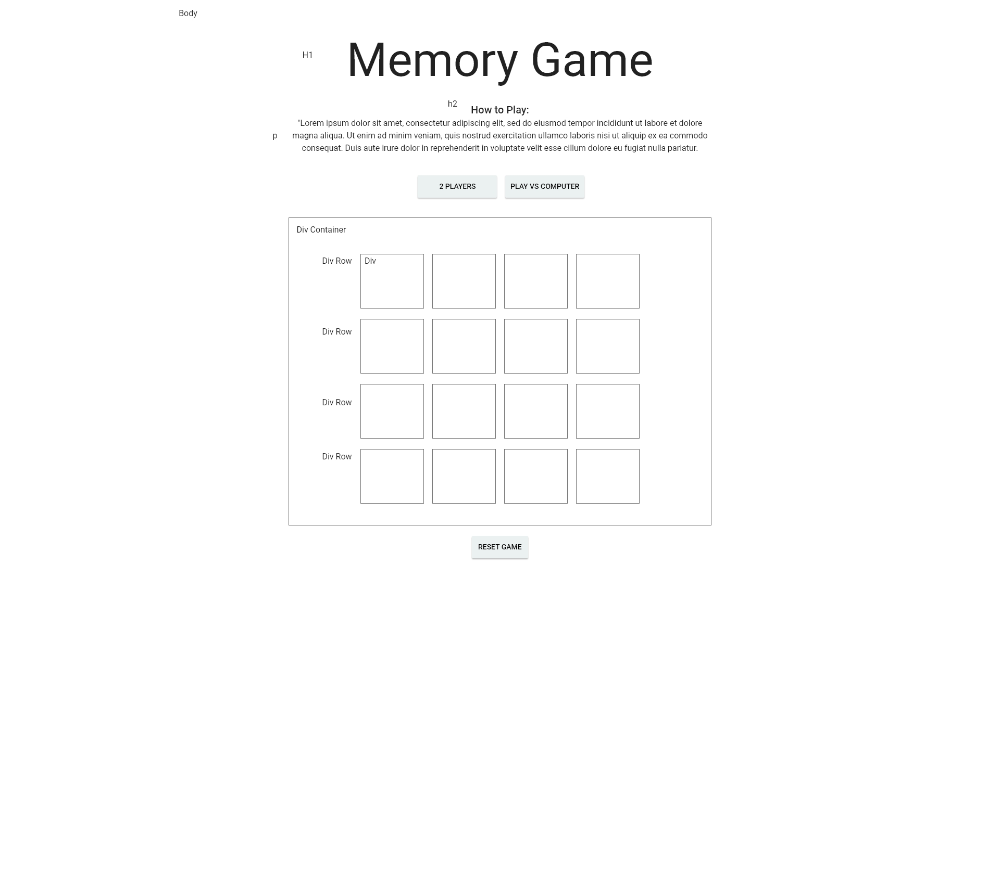

# Colorful Memory Game
Memory/Concentration game - Project 1 for General Assembly WDI-19

[Live Site](http://gschultz64.github.io/Memory)

## Wireframe

## Planning
I had a hard time deciding what kind of game to make, mostly because I wasn't sure what I was capable of achieving in one week. I thought the memory game would be a good way to build on the experience of making the tic-tac-toe game at the end of week 1. 

Once I picked a memory game, I started investigating using an API to make it more dynamic. By the end of Day 2, I realized this was too ambitious for this project, so I decided to just use an array of colors for the memory game. 

It helped me to do a wireframe so that I could visualize what the game would look like, and which elements I would need. I also decided to use jQuery and Materialize CSS to keep the layout simple.

## Trials and Tribulations
After getting stuck in API-land on Day 2, I hoped to get a lot done on Day 3 of project week. I felt like I made progress, but didn't anticipate quite how long certain tasks would take. That theme continued throughout the week.

I definitely struggled with understanding how the different data structures needed to fit together in order for the game to work, so that was my biggest roadblock throughout the week.

## Extra Features
I wanted to allow the player to choose between playing alone or solitaire, against another player, or against an AI/computer. Since the game is only set up for player vs. player, I would like to add the other modes.

I really liked the idea of using the Spotify API to play different song clips for each color in the game, so I would like to try adding that in the future.

I also have audio files that I can use for sound effects, but I didn't get to implementing those yet.

Allow the player to choose the color palette for the game, especially if someone wants a color-blind mode.

Add a mode to play the game forever without having to hit "reset game". So the board would have to reset as soon as all matches are made.

## Final Thoughts
I really appreciated Materialize CSS, because it kept my CSS to a minimum, and allowed me to pretty easily make the game responsive. 

I feel so much more comfortable with DOM manipulation and jQuery.

This project pushed me further as a programmer! 
